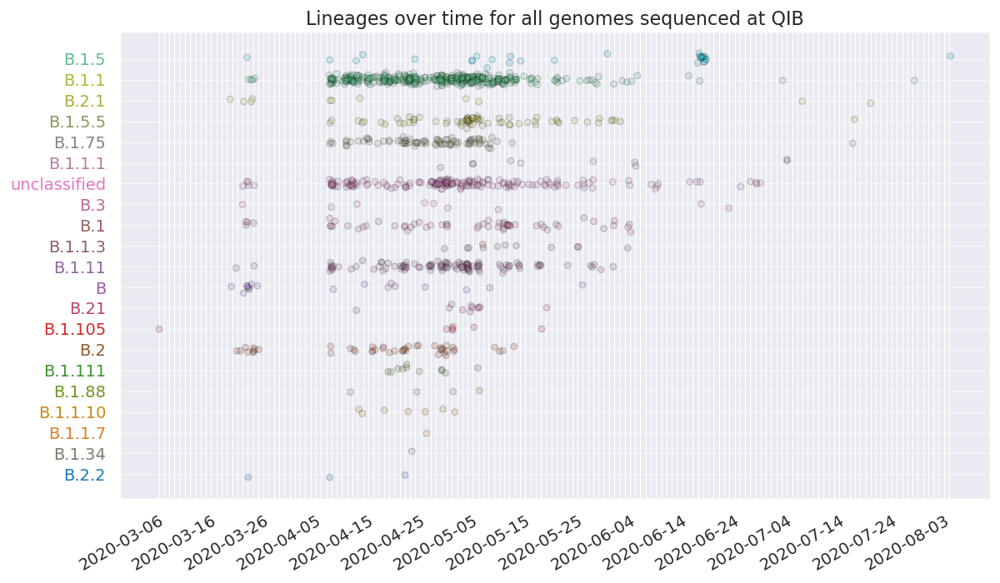

---
title: | 
    {width=2in} "Ipsum Lorem report, Brazilian style"
author: [Leonardo de Oliveira Martins]
date: "2024.04.26"
keywords: [Markdown, LaTeX, Pandoc, PDF, EISvogel, Brazilian]
titlepage: true,
css:
- assets/pandoc3.css
toc-depth: 2
to: html5
from: markdown
...
<!-- pandoc -V fontsize=12pt -V geometry:margin=1in -\-template eisvogel -\-listings -->
# Mussum Ipsum
Mussum Ipsum, cacilds vidis litro abertis. Paisis, filhis, espiritis santis. Suco de cevadiss deixa as pessoas mais interessantis. In elementis mé pra quem é amistosis quis leo. Não sou faixa preta cumpadi, sou preto inteiris, inteiris.

Interessantiss quisso pudia ce receita de bolis, mais bolis eu num gostis. Quem num gosta di mé, boa gentis num é. Quem num gosta di mim que vai caçá sua turmis! Si u mundo tá muito paradis? Toma um mé que o mundo vai girarzis!

Em pé sem cair, deitado sem dormir, sentado sem cochilar e fazendo pose. Si num tem leite então bota uma pinga aí cumpadi! Copo furadis é disculpa de bebadis, arcu quam euismod magna. Interagi no mé, cursus quis, vehicula ac nisi.

Viva Forevis aptent taciti sociosqu ad litora torquent. A ordem dos tratores não altera o pão duris. Sapien in monti palavris qui num significa nadis i pareci latim. Atirei o pau no gatis, per gatis num morreus.

Pra lá , depois divoltis porris, paradis. Cevadis im ampola pa arma uma pindureta. Todo mundo vê os porris que eu tomo, mas ninguém vê os tombis que eu levo! Diuretics paradis num copo é motivis de denguis.

Detraxit consequat et quo num tendi nada. Praesent malesuada urna nisi, quis volutpat erat hendrerit non. Nam vulputate dapibus. Mauris nec dolor in eros commodo tempor. Aenean aliquam molestie leo, vitae iaculis nisl. Per aumento de cachacis, eu reclamis.

Nec orci ornare consequat. Praesent lacinia ultrices consectetur. Sed non ipsum felis. Tá deprimidis, eu conheço uma cachacis que pode alegrar sua vidis. Nullam volutpat risus nec leo commodo, ut interdum diam laoreet. Sed non consequat odio. Vehicula non. Ut sed ex eros. Vivamus sit amet nibh non tellus tristique interdum.

Casamentiss faiz malandris se pirulitá. Suco de cevadiss, é um leite divinis, qui tem lupuliz, matis, aguis e fermentis. Quem manda na minha terra sou euzis! Mais vale um bebadis conhecidiss, que um alcoolatra anonimis.

{width=100%}

## Timestamp  
You can add html tags to your markdown and they will be rendered.  
